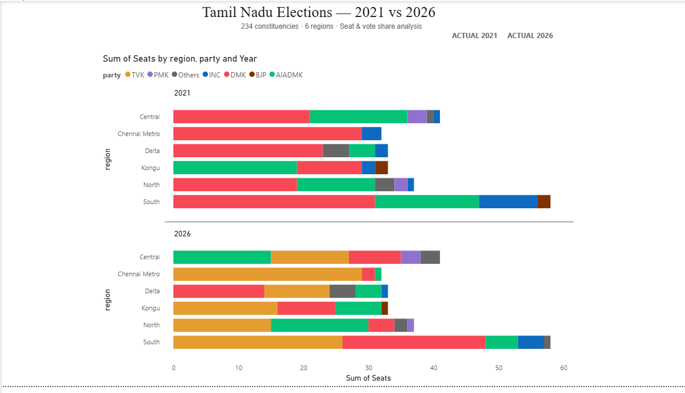
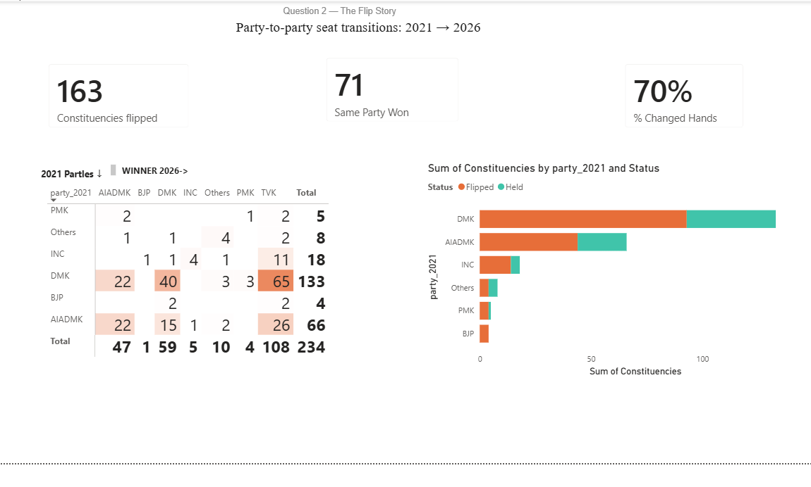
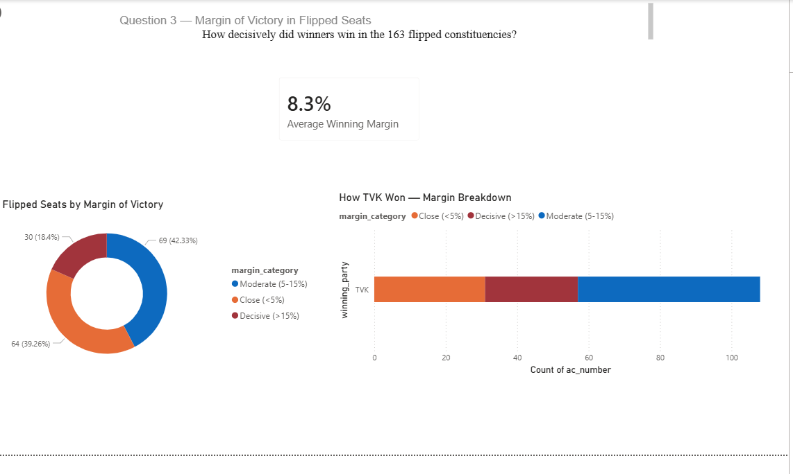

# Decoding Tamil Nadu 2026 — Data Analytics Project

A storytelling-first data analytics project built for the **Codebasics Resume Project Challenge**.  
This project analyses the 2026 Tamil Nadu Assembly Election results using only publicly available Election Commission of India (ECI) data.

---

## Problem Statement

AtliQ Media is producing a one-hour fact-based TV show on the 2026 Tamil Nadu Assembly Election results. As a freelance data analyst, the task was to find the most interesting stories in the 2026 results, build clear charts for each story, and present them in a way that helps the editorial team plan the show.

All analysis is strictly non-partisan. No exit polls, no news articles, no social media data was used at any point.

---

## Three Stories Covered

### Story 01 — The Map Redrawn
How did the seat distribution shift across Tamil Nadu's six regions between 2021 and 2026?  
- In 2021, DMK had the highest seat count in 5 of 6 regions  
- In 2026, TVK has the highest seat count in 5 of 6 regions  
- Delta is the only region where the leading party did not change (DMK leads both years)

### Story 02 — The Great Flip
How many constituencies changed hands between 2021 and 2026?  
- 163 of 234 constituencies changed the winning party — 70% of the assembly  
- TVK won 108 seats; DMK won 59; AIADMK won 15  
- Only 71 seats (30%) were retained by the same party

### Story 03 — Margin of Victory
How wide were the winning margins in flipped constituencies?  
- Average margin of victory in flipped seats: **8.3%**  
- 81.6% of flipped seats had a margin above 5%  
- Close (<5%): 30 seats · Moderate (5–15%): 69 seats · Decisive (>15%): 64 seats

---

## Tools Used

| Tool | Purpose |
|---|---|
| SQL | Data cleaning, joining tables, deriving winners, calculating margins |
| Power BI | Dashboard creation and data visualisation |
| Excel / CSV | Raw data storage and initial profiling |

---

## Data Sources

All data sourced exclusively from the Election Commission of India. No exit polls, opinion polls, or news articles were used.

| Source | Description |
|---|---|
| [ECI Results Portal 2026](https://results.eci.gov.in/ResultAcGenMay2026) | Constituency-wise results, candidates, votes for 2026 |
| [ECI Statistical Reports](https://eci.gov.in/statistical-reports) | Official PDF reports for 2021 Tamil Nadu Assembly |
| `2026_results.csv` | Codebasics starter pack — 234 constituencies, candidate-level data |
| `2021_results.csv` | Codebasics starter pack — same schema as 2026 |
| `constituency_master.csv` | Region mapping for all 234 constituencies |
|`changed_constituencies.csv`|constituencies and Ac_number mapping for party in 2021 and party 2026|

---

## Repository Structure

```
├── data/
│   ├── 2021_results.csv        # Raw 2021 election results
│   ├── 2026_results.csv        # Raw 2026 election results
│   └── constituency_master.csv    # Constituency to region mapping
│
├── sql/
│   └── O1_regional_seats.sql     # All SQL queries used for analysis
│   |--O2_flip_matrix.sql
    |--O3_margin_analysis.sql
├── dashboard/
│   └── tamil_nadu_election_analysis_dashboard.pbix          # Power BI dashboard file
│
├── presentation/
│   └── tn_election_atliq.odp   # 10-slide deck for AtliQ Media
│
└── README.md
```
## Dashboard Preview

### Tab 1 — Geographic Story

> TVK swept all 6 regions in 2026. Chennai Metro flipped almost entirely from DMK to TVK.

### Tab 2 — The Flip Story

> 70% of constituencies changed hands. DMK lost 65 seats directly to TVK — the single biggest flow.

### Tab 3 — Margin of Victory

> 46% of TVK's wins were decisive victories. Average winning margin was 8.3%.

---
## How to Reproduce This Analysis

**Step 1 — Load the data**  
Import `2021_results.csv`, `2026_results.csv`, and `constituency_master.csv` into your SQL environment or Power BI.

**Step 2 — Run SQL queries**  
Use the queries in `sql/analysis_queries.sql` to:
- Derive the winner per constituency (candidate with highest votes)
- Join 2021 and 2026 results by constituency number
- Identify flipped constituencies (where winning party changed)
- Calculate margin of victory as a percentage of total valid votes
- Categorise margins into Close (<5%), Moderate (5–15%), Decisive (>15%)

**Step 3 — Load into Power BI**  
Open `tamil_nadu_electin_dashboard.pbix` or connect Power BI to your SQL output tables.  
The dashboard has three pages:
- `party_performance` — regional seat distribution 2021 vs 2026
- `changed_constituencies` — flip analysis and transition matrix
- `Margin_Analysis` — margin of victory breakdown

**Step 4 — Review the presentation**  
Open `tn_election_atliq.odp` for the 10-slide editorial pitch deck built for AtliQ Media leadership.

---

## Key Definitions

| Term | Definition |
|---|---|
| **Winner** | Candidate with the highest vote count in a constituency |
| **Flipped seat** | Constituency where the winning party in 2026 is different from 2021 |
| **Margin %** | (Winner votes − Runner-up votes) ÷ Total valid votes × 100 |
| **Close win** | Margin below 5% |
| **Moderate win** | Margin between 5% and 15% |
| **Decisive win** | Margin above 15% |
| **Region** | One of six geographic groupings: Central, Chennai Metro, Delta, Kongu, North, South |

---

## Neutrality Statement

This project is strictly non-partisan. It does not:
- Explain why any party won or lost
- Predict future election outcomes
- Use any data outside the official ECI results
- Include images of party leaders or party symbols
- Make any claims about communities, religions, or regions

All findings are based solely on publicly available Election Commission of India data.

---

## Author

**Nikita**  
Data Analytics — Career Transition Project  
Tools: SQL · Power BI · Excel  
Challenge: [Codebasics Resume Project Challenge — Tamil Nadu 2026](https://codebasics.io)
